# OxyCSBot

This is a demo/tutorial of how to build a Slack chatbot using the [Event API](https://api.slack.com/events-api), and also provides a framework for a tags-based chatbot.

## Table of Contents

* 0\. Create Accounts
* 1\. Setup GitHub
* 2\. Setup Heroku
* 3\. Setup Slack
* 4\. Authenticate Heroku to Slack
* 5\. Direct Slack to Heroku
* 6\. Test Your Chatbot
* 7\. OxyCSBot Structure

## 0. Create Accounts

In addition to a Slack account, we will be hosting the chatbot on [GitHub](https://github.com/) and running it as a free [Heroku](https://www.heroku.com/) app. Make sure you have accounts on all three services before continuing. This tutorial assumes you already have a Slack workspace where you can deploy the chatbot.

## 1. Setup GitHub

To get started with a chatbot, go to the [repository for this tutorial](https://github.com/justinnhli/oxycsbot), and fork it so you have your own copy of the code. 

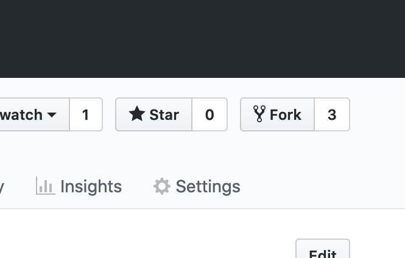

## 2. Setup Heroku

In your [Heroku dashboard](https://dashboard.heroku.com/apps), create a new app to run your chatbot. You can call the app whatever you want.

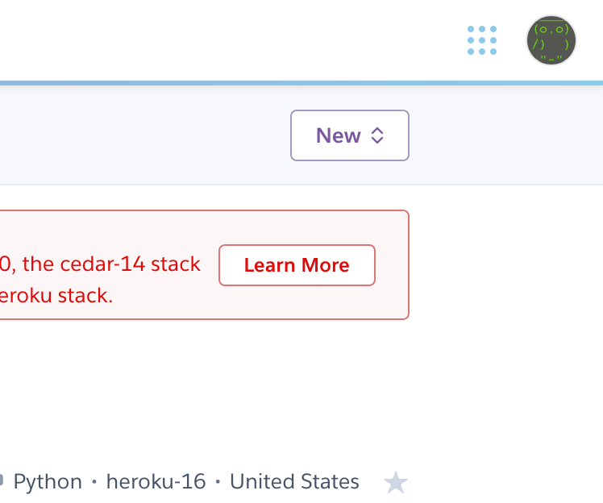

To link the app to the GitHub repository, go to the Deploy tab. Under Deployment Method, click Connect to GitHub. Type in the name of your repository, then click Connect.

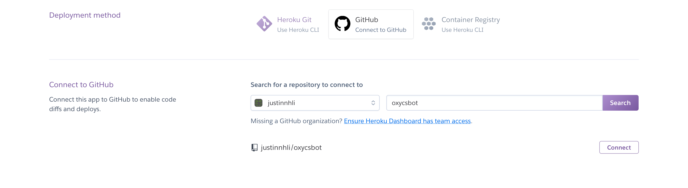

## 3. Setup Slack

In Slack, create a new app. Again, you can call the app whatever you want.

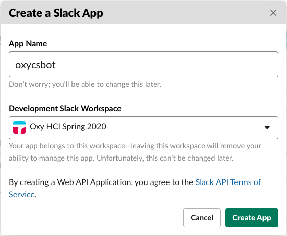

Once the app has been created, scroll down and make a note of the Signing Secret. You will need this later.

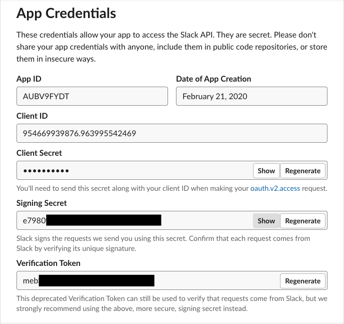

Go to the OAuth & Permissions page (linked from the left), then scroll down to the Scopes section. This tells Slack what your chatbot is allowed to do. For now, just give the chatbot `chat:write` permission, which will let it send messages.

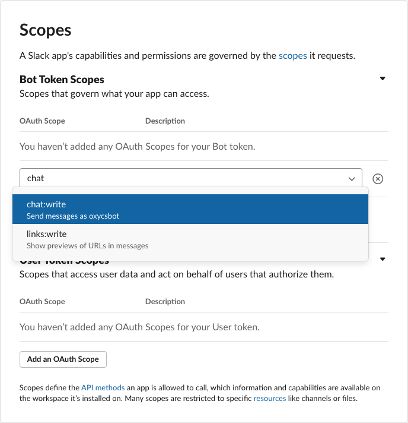

Scroll back to the top of the page, then click Install App. Slack will ask you to confirm that the chatbot should have access to your workspace. After clicking allow, there should now be a Bot User OAuth Access Token:

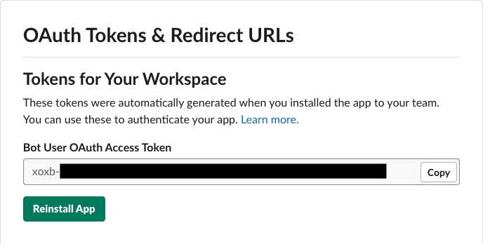

Again, make a note of this token, as you will need this later.

## 4. Authenticate Heroku to Slack

To authenticate your chatbot to Slack, go back to your app on Heroku, and go to the Settings tab. Under Config Vars, click on Reveal Config Vars.

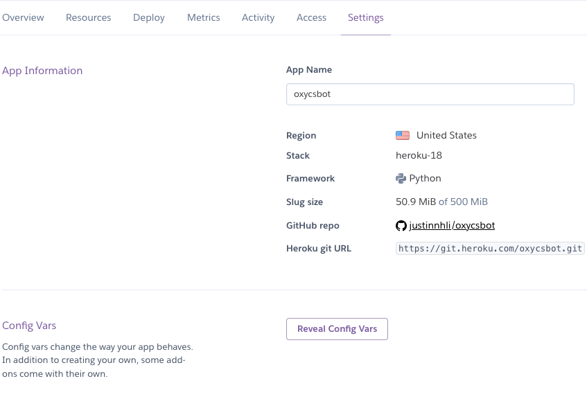

Create two new config variables, `SLACK_BOT_TOKEN` and `SLACK_SIGNING_SECRET`, and paste in the strings from before:


## 5. Direct Slack to Heroku

With the authentication tokens ready, you can now deploy your app. Go to the bottom of the Deploy tab in Heroku, and click Deploy Branch.

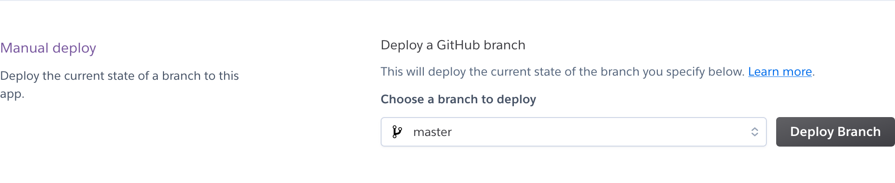


In the Resources tab, make sure that your app has an active Heroku dyno. If not, click on the edit icon and activate it with the switch.

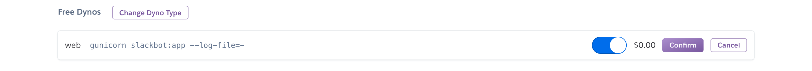

To check that the Heroku app is work, click on Open App at the top right.

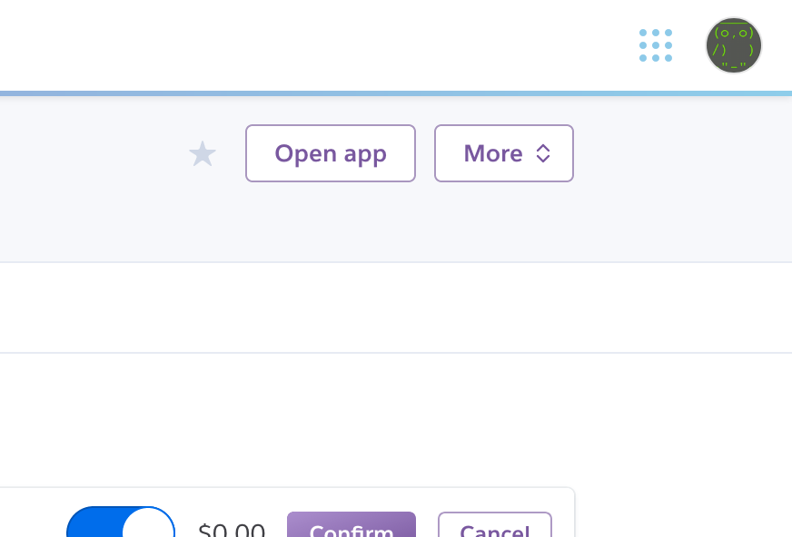

The home page of the app should return a 404 Not Found error, but that's okay. We are interested in whether the app will be able to receive Slack events. To do that, add `/slack/events` to the URL. For example, my app has the URL `https://oxycsbot.herokuapp.com/` so I would go to `https://oxycsbot.herokuapp.com/slack/events`. If the Heroku app is deployed correctly, it should show a page saying "These are not the slackbots you're looking for."


Back in Slack, go to the Events Subscription page. Enable events, then paste in the Heroku URL.

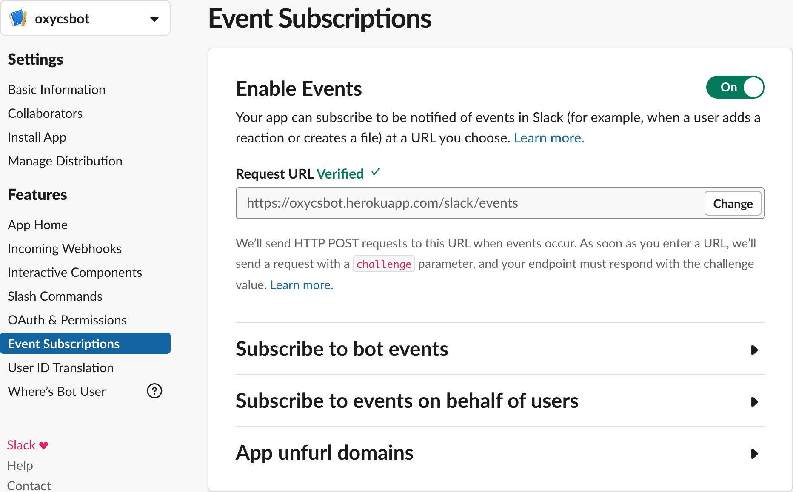

Under Subscribe to Bot Events, add the `message.channels` permission, which will allow your chatbot know about new messages.

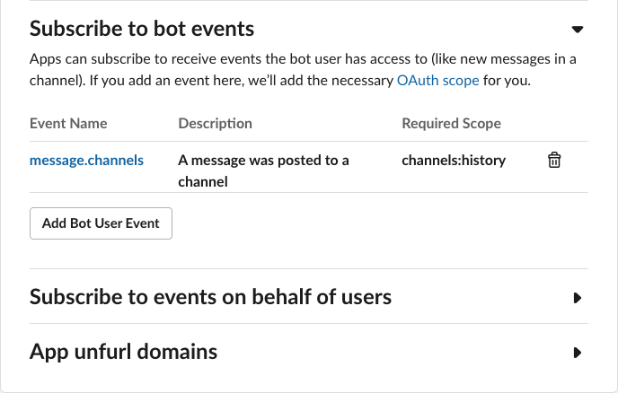

Once you save your changes, you will need to reinstall your app.

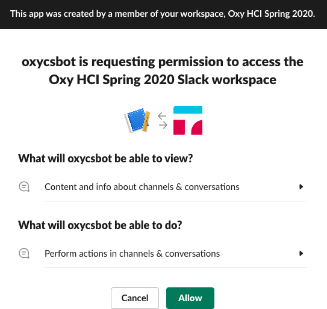

## 6. Test Your Chatbot

Finally, it's time to test your chatbot. In Slack, create a new channel. To invite your chatbot to the channel, write a message mentioning its name.

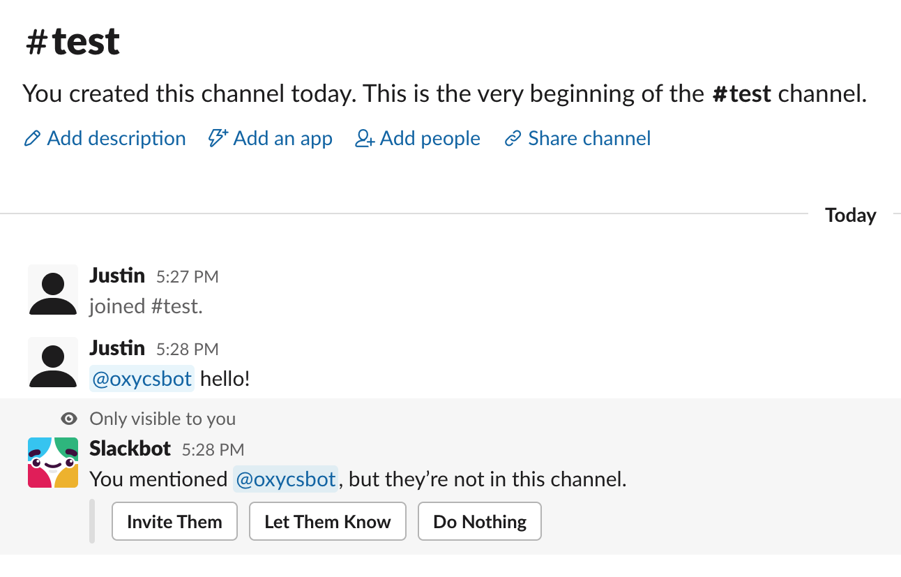

Once the chatbot is in the channel, send another message mentioning them. If everything is working, the chatbot should respond.

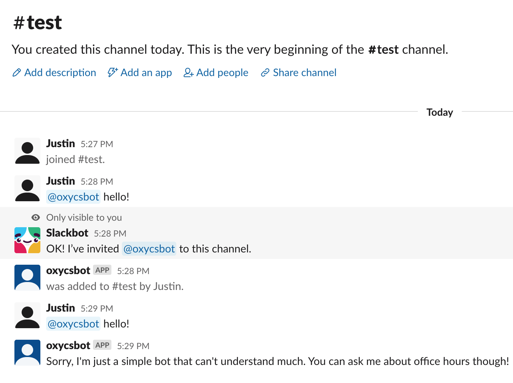

## OxyCSBot Structure

The starter code is available on GitHub as a [repository](https://github.com/justinnhli/oxycsbot) and as a [zip file](https://github.com/justinnhli/oxycsbot/archive/master.zip). The function-by-function documentation is in the source code, which I won't repeat here. Instead, let's look at an example chatbot, OxyCSBot, that can direct students to professor's office hours. First, a flow chart of how this bot should react:

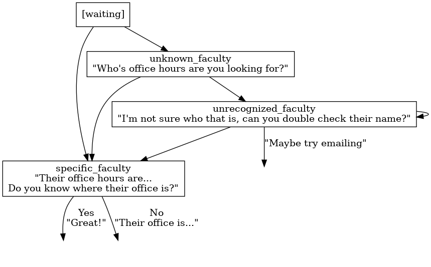

This flow chart already defines all the necessary states: the default `waiting` state, and `unknown_faculty`, `unrecognized_faculty`, and `specific_faculty` states. This means we need to write seven state functions (we don't need an `on_enter` function for the default `waiting` state), and several `finish` functions that would quit the flow:

* `respond_from_waiting`
* `on_enter_specific_faculty`
* `respond_from_specific_faculty`
* `on_enter_unknown_faculty`
* `respond_from_unknown_faculty`
* `on_enter_unrecognized_faculty`
* `respond_from_unrecognized_faculty`
* `finish_location`
* `finish_success`
* `finish_fail`
* `finish_confused`
* `finish_thanks`

The last two `finish` functions, for `confused` and `thanks`, are generic and don't show up on the flow chart.

For the tags, we probably want to recognize the name of each professor. This is the main determiner for whether to go to the `specific_faculty` or `unknown_faculty` state. So the code looks like this:

```python
for professor in self.PROFESSORS:
    if professor in tags:
        self.professor = professor
        return self.go_to_state('specific_faculty')
return self.go_to_state('unknown_faculty')
```

The rest of the code is not much harder than this, so feel free to look through and see how the bot works.
